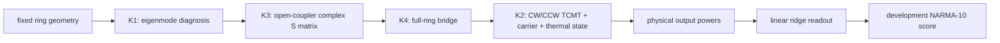

# Nonlinear 3D FDTD Photonic Reservoir

An open research repository for a **geometry-constrained silicon microring
reservoir** whose optical parameters are validated by electromagnetic simulation
and whose task dynamics are solved with an energy-normalized CW/CCW temporal
coupled-mode model.

> **Evidence boundary — read first.**
> Despite the historical repository name, the current method is not an
> end-to-end nonlinear 3D-FDTD reservoir simulation. Full-wave EM is the intended
> authority for geometry-dependent optical inputs; CW/CCW TCMT is the intended
> task solver. The K0 recovery contract is complete, but K1–K5 implementation and
> physical-acceptance gates remain open. No optical parameter currently passes
> the complete K1–K4 evidence chain, no fabricated device is claimed, and no
> blind NARMA-10 result is reported from this repository.

## Supervisor quick start

For a concise technical review, read these documents in order:

1. [`docs/PROJECT-CHARTER.md`](docs/PROJECT-CHARTER.md) — physical scope,
   success criteria, and stop conditions.
2. [`docs/decisions/2026-09-13-optical-chain-recovery-plan.md`](docs/decisions/2026-09-13-optical-chain-recovery-plan.md)
   — canonical K0–K5 recovery plan.
3. [`reports/OPTICAL-PARAMETER-STATUS.md`](reports/OPTICAL-PARAMETER-STATUS.md)
   — accepted, conditional, and retracted optical claims.
4. [`BACKLOG.md`](BACKLOG.md) — current implementation order and open gates.
5. [`BLIND-SUITE-MOVED.md`](BLIND-SUITE-MOVED.md) — why blind evaluation is
   permanently disabled here.

The implementation contract is recorded in
[`2026-09-14-recovery-implementation-contract.md`](docs/decisions/2026-09-14-recovery-implementation-contract.md).

## Research objective

The target is a reproducible FDTD-calibrated TCMT reservoir for a constrained
silicon microring family:

| Quantity | Scope |
|---|---:|
| Silicon waveguide cross-section | `450 × 220 nm` |
| Ring center radius | `4.775 µm` |
| Bus geometry | symmetric two-bus add/drop |
| Gap range | `150–250 nm` |
| Development seeds | `5` |
| Original blind target | `10` seeds |
| Data split | `200 / 3000 / 2000` |
| Target metric | median NMSE `< 0.05` and at least 8/10 seeds `< 0.05` |

Global geometry, cross-section, and topology optimization are deliberately out
of scope until the constrained optical chain is trustworthy.

## Model and evidence flow



The required role separation is:

- **FDTD / mode solving:** geometry-dependent `n_eff`, `n_g`, coupling,
  resonances, linewidths, modal overlap, and complex port response;
- **source-supported inputs:** absorption, scattering, carrier, thermal, and
  material parameters that a lossless EM proxy cannot establish;
- **CW/CCW TCMT:** long-timescale nonlinear and task dynamics;
- **linear ridge readout:** the only trained layer.

Unknown physical quantities may not be fitted to NARMA-10 performance.

## Current status

| Gate | Purpose | Public `main` status |
|---|---|---|
| K0 | Scope, evidence ladder, ownership, and budget contract | **CLOSED** |
| K1 | Reproducible eigenmode and supermode diagnosis | **OPEN** |
| K2 | Energy-normalized CW/CCW TCMT and development scorer | **OPEN** |
| K2a | Source-supported material, carrier, thermal, and process-loss inputs | **OPEN** |
| K3 | Open bus–ring coupler S-parameters | **OPEN** |
| K4 | Full-ring spectrum / pole / ringdown bridge | **OPEN** |
| K5 | Development search and final candidate acceptance | **OPEN** |
| B25 | Historical validation-spend review before new paid solves | **OPEN** |

The original blind suite was moved—not copied—to
[`Kerr-Ring-Reservoir`](https://github.com/hasanklnc011-alt/Kerr-Ring-Reservoir).
This repository retains development datasets and benchmark utilities, but its
blind-evaluation entry point must fail closed while `BLIND-SUITE-MOVED.md`
exists. Deleting that guard would violate the single-suite contract.

## Why the recovery plan was necessary

Earlier simulations produced useful diagnostics, but several numerical values
were stated more strongly than their evidence allowed. The recovery line keeps
the raw observations while retracting unsupported physical interpretations.

### 1. Resonance location is more stable than the loss channels

The 12 and 14 steps-per-wavelength FDTD rungs placed the resonance at
`1.540945 µm` and `1.540865 µm`. The 80 pm difference is an observation, not a
confidence interval. Across the same refinement:

- the resonance displacement was about 0.42% of one FSR;
- external-Q variation was approximately 1.28%;
- loaded-Q variation was approximately 6.56%, above the 5% gate;
- the add-port power changed by approximately 54%.

The resonance position therefore appeared substantially more stable than the
partition of loss and scattering channels.

### 2. Intrinsic Q was not identifiable from the lossless proxy

The simulated materials were nondispersive and lossless proxies. Bend radiation
fell near the numerical noise floor, while an earlier transmission fit produced
an apparent `Q_i` roughly three orders of magnitude lower. That number cannot be
treated as physical intrinsic loss: absorption and process scattering were not
present, and numerical loss could not be separated cleanly.

Current rule: `Q_i = Q_rad + Q_abs + Q_scatter` must be assembled from the
appropriate EM and source-supported channels; it is not inferred from a
lossless spectrum by residual fitting.

### 3. External Q lacked a valid independent cross-check

An earlier supermode method selected modes by index ordering rather than
parity/overlap and returned nearly gap-independent coupling. Its apparent
agreement/disagreement with FDTD was therefore not a valid second method.
`Q_e` remains unaccepted until K1 provides stable modal selection and K3
provides a de-embedded complex coupler S-matrix.

### 4. The local mode-solver values were diagnostic only

The historical `n_eff/n_g` sequence varied by approximately 3% with grid
resolution, and a fixed-grid translation changed `n_eff` from `2.298684` to
`2.364882`. These values are retained as evidence of a numerical representation
problem, not as TCMT production inputs. K1 must establish mode identity,
subpixel behavior, mesh convergence, group index, and overlap without silent
fallback.

### 5. Port observability required repair

Early spectra were contaminated by bus-facet Fabry–Pérot fringes and incomplete
port accounting. Extending the buses into the absorbing boundary and monitoring
all relevant ports greatly improved off-resonance energy closure, but the
remaining add/reflection observables did not converge sufficiently to support a
physical backscattering or loss claim.

The complete claim audit is maintained in
[`reports/OPTICAL-PARAMETER-STATUS.md`](reports/OPTICAL-PARAMETER-STATUS.md).

## K0–K5 recovery ladder

### K0 — Contract and provenance

Defines the fixed geometry family, V1–V5 evidence ladder, budget limits,
retraction policy, and division between EM-derived and literature-derived
parameters. This is the only completed recovery stage.

### K1 — Mode diagnosis

Requires version-locked local solving, explicit subpixel behavior, TE/core/
overlap/parity mode identity, 16/20/26/32 steps-per-wavelength refinement,
translation checks, group-index convergence, and no index-order fallback.

### K2 / K2a — Dynamical model and physical inputs

The target model contains CW/CCW optical amplitudes, carrier density, and
temperature with explicit unit conventions: `|a|²` in joules and `|s|²` in
watts. Kerr, TPA, FCA/FCD, and thermal effects remain separately switchable.
K2a must source every material, carrier, thermal, absorption, and process-loss
input before physical acceptance.

### K3 — Open coupler

Measures a de-embedded complex S-matrix for the actual stack and curvature.
Acceptance requires complete port accounting, energy residual `< 10⁻³`, final
coupling change `< 5%`, and meaningful phase change `< 2°`.

### K4 — Full-ring bridge

Predicts the ring response from K3 before measuring the full-ring spectrum,
then compares resonance location, linewidth, port powers, shared poles, and
ringdown. Missing physics cannot be closed by attaching a broad uncertainty
label.

### K5 — Development search

Searches only sourced and validated parameter ranges. A candidate must pass the
development and pre-registered robustness gates before any final EM reserve is
used. Because the blind suite has moved, this repository does not execute the
final blind score under the current contract.

## What has and has not been demonstrated

**Demonstrated or documented:**

- a fixed silicon-MRR geometry family and staged validation contract;
- hash-locked development/blind dataset manifests from the original line;
- local FDTD builders, manifests, provenance validation, and historical rungs;
- identification and repair of major port-placement and Fabry–Pérot issues;
- explicit retraction/qualification of unsupported `Q_i`, `Q_e`, `n_eff`, and
  `n_g` claims;
- a fail-closed transfer of the single blind suite to the Kerr repository.

**Not yet demonstrated:**

- a complete K1 eigenmode acceptance;
- an accepted complex bus–ring coupler S-matrix;
- an accepted full-ring-to-TCMT bridge;
- source-complete carrier, thermal, absorption, and process-loss parameters;
- a validated nonlinear CW/CCW reservoir result;
- a fabricated PIC, experimental measurement, or blind NARMA-10 success.

## Repository map

```text
docs/PROJECT-CHARTER.md       physical scope and acceptance boundary
docs/decisions/               chronological decisions and retractions
docs/coordination/            implementation handoffs and reviews
reports/OPTICAL-PARAMETER-STATUS.md
                              canonical optical-claim audit
reports/FLEXCREDIT-LEDGER.md  historical cloud-cost ledger
fdtd/mrr/                     constrained MRR geometry and study builder
fdtd/tidy3d_build/            local-only linear simulation construction
fdtd/provenance/              manifest schemas and validation
benchmarks/narma10_np/        development benchmark utilities
manifests/                    locked FDTD and dataset records
tests/                        benchmark and FDTD validation tests
BACKLOG.md                    current recovery work
BACKLOGLOG.md                 closed and superseded work history
BLIND-SUITE-MOVED.md          permanent blind-path guard
```

## Local verification

The committed test entry points are:

```bash
python -m tests.narma10_np.run_tests
python -m tests.fdtd.run_tests
```

Additional local mode-solver work must use the version-locked environment
defined by the active K1 implementation. Raw HDF5 files, API keys, and GPT Pro
handoff artifacts are excluded from Git.

## Cost and execution discipline

The ledger records `79.0726` historical FlexCredits spent and a previously
recorded balance of `115.7358` FlexCredits; neither number is a live balance
query. Before any new paid solve, the project requires:

1. a live balance and commitment check;
2. closure or explicit disposition of B25;
3. a written `estimate_cost` result and per-run ceiling;
4. explicit approval for that solve.

The K0 budget envelope assigns at most 2 FC to remote mode comparison, 10 FC to
the coupler, 15 FC to the ring bridge, and preserves 20 FC for final validation.
Allocation is not permission to submit a cloud job.

## Relationship to Kerr-Ring-Reservoir

The later [`Kerr-Ring-Reservoir`](https://github.com/hasanklnc011-alt/Kerr-Ring-Reservoir)
is a separate Plan 2 research line with platform-independent Kerr candidates and
its own P0–P6 program. Its results do not retroactively validate this silicon
K0–K5 recovery line. The repositories share the benchmark contract and budget
history, but only the Kerr repository holds the single legitimate blind suite.

---

*Public status as of 15 September 2026: K0 complete; K1/K2/K2a/K3/K4/K5 and
B25 open; no fully accepted optical parameter, no physical acceptance, and no
blind result from this repository.*
